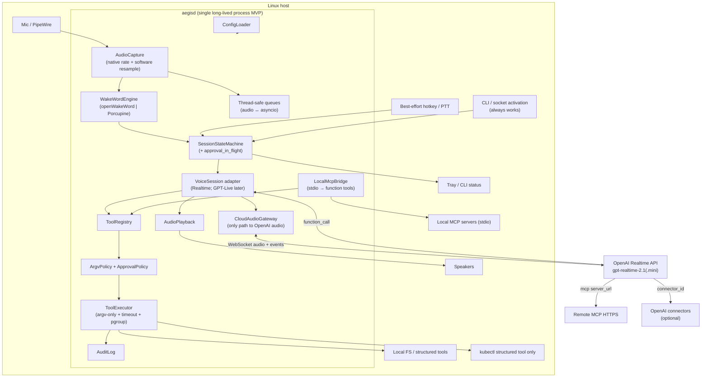
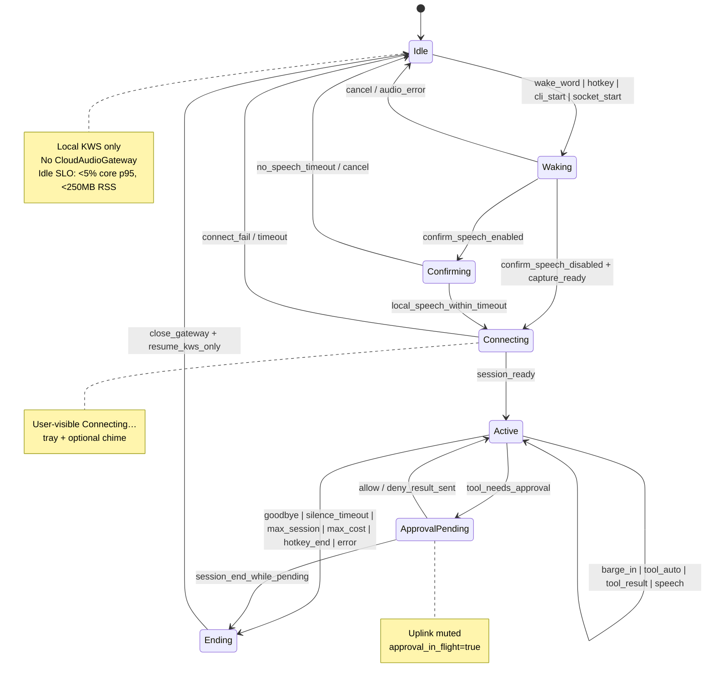
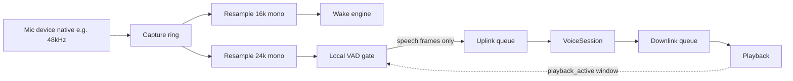
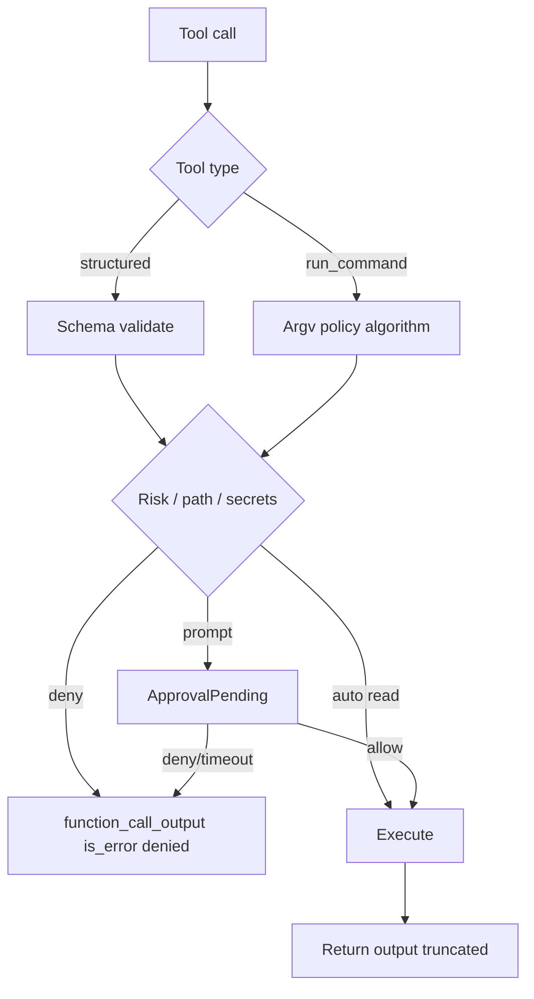
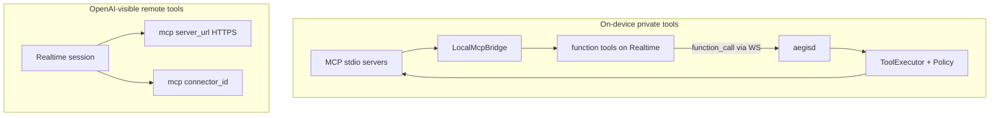
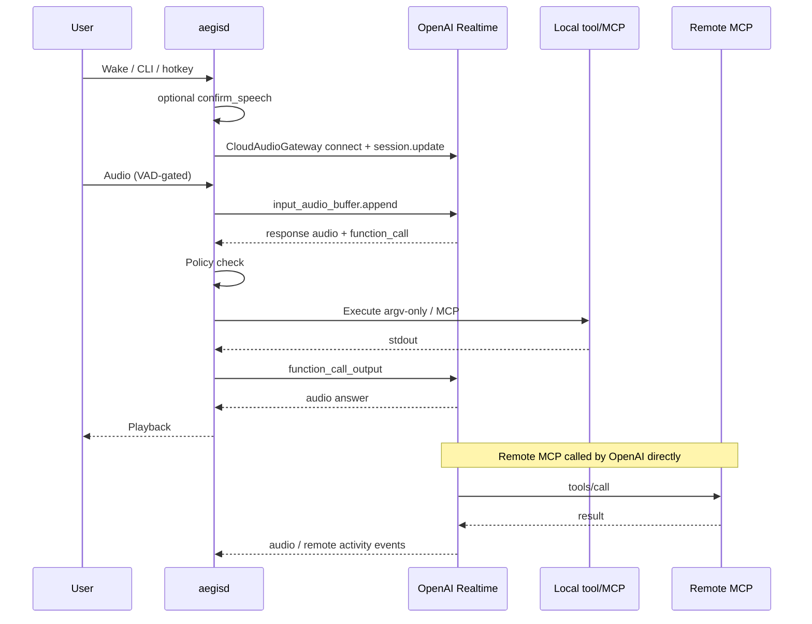

# Aegis — Always-On Personal Voice AI Agent

| Field | Value |
| --- | --- |
| **Document title** | Aegis Architecture & Design |
| **Author** | TBD |
| **Date** | 2026-07-12 |
| **Status** | **Approved for implementation (rev 4)** |
| **Repo** | `/home/crimsonlynx/git/ai-audio-agent` (greenfield) |
| **Target platform** | Linux desktop (modern workstation; fish shell; PipeWire/PulseAudio) |

> **User approval (2026-07-12):** Design accepted. Name **Aegis** / wake **“Hey Aegis”** locked. Stack: Python 3.12+, openWakeWord default (Porcupine pluggable), `gpt-realtime-2.1-mini` default (full `2.1` for oncall), single-user trust model. **Implementation start authorized — next: PR 1 scaffold.**

---

## Overview

Aegis is a local-first, always-on personal voice agent for Linux desktops. It runs as a low-footprint daemon that listens only for a wake phrase on-device. After activation (wake word, hotkey, or CLI), it opens a short-lived speech-to-speech session with OpenAI’s Realtime API (`gpt-realtime-2.1` / `gpt-realtime-2.1-mini`), holds a full-duplex conversation, and executes local tools — structured file/git helpers, tightly policed argv-only commands, kubectl-safe operations, log inspection, and MCP servers — so a human and agent can pair-debug incidents together.

This design prioritizes three non-negotiables: (1) **idle efficiency** — zero cloud audio while waiting for wake; (2) **security** — private system access stays on-device with structured tools preferred over raw shell, argv-level policy, approval for non-read actions, and audit logs; (3) **swappable voice backend** — ship day one on Realtime API, with a **minimal** session abstraction so GPT-Live can replace it when that API becomes generally available. Implementation is phased from a safe MVP to a full on-call pack.

---

## Background & Motivation

### Current state

Coding agents and chat UIs are excellent at tool use but require keyboard context switching. Commercial voice assistants are either cloud-always-listening, weak at local system access, or not designed for SRE/on-call workflows (kubectl, log tails, incident notes). No off-the-shelf product cleanly combines:

- Always-on **local** wake word with negligible idle cost
- Full-duplex voice (interruptions, backchannels) via modern OpenAI speech models
- First-class **local** tool runtime + MCP for private infrastructure

### Pain points this solves

| Pain | How Aegis addresses it |
| --- | --- |
| Hands busy during incidents | Voice-driven investigation while eyes stay on dashboards |
| “Always listening” privacy fear | Wake path never leaves the machine |
| Agent can’t touch the real system | Local function tools + MCP bridge with guardrails |
| Expensive always-on cloud audio | Session lifecycle: connect only after wake; tear down promptly; silence-gated uplink; cost caps |
| Vendor lock on unreleased models | Minimal VoiceSession abstraction; Realtime first, GPT-Live later |

### Primary persona

On-call engineer / power Linux user who wants a “second pair of hands” during incidents: read logs, run safe commands, summarize, propose config edits — with the human still in control.

### Trust model (decided for v1)

**Single-user laptop/desktop under the owner’s login session.** No multi-user ACL, no remote control plane, no shared daemon across users. Socket and files are user-owned (`0600` / `0700`). Multi-user machines are out of scope until explicitly redesigned.

---

## Goals & Non-Goals

### Goals

1. **Always-on local wake** with split efficiency SLOs (see Efficiency SLOs below) — never stream idle mic audio to the cloud.
2. **Full-duplex voice sessions** via OpenAI Realtime (`gpt-realtime-2.1` family) with natural barge-in.
3. **Local tool execution** for private system access (function tools executed by the daemon), preferring **structured tools** over raw shell.
4. **MCP support**: local stdio servers bridged as function tools; remote HTTPS MCP via Realtime `mcp` tool type.
5. **Approval & audit** for destructive or high-privilege actions; auto only for true read-class work.
6. **Activation paths**: wake word + **always-works CLI/socket** + best-effort global hotkey/PTT (accessibility, noisy rooms, FAR escape).
7. **Phased delivery** from MVP to on-call pack without rewriting core architecture.
8. **Cost control**: free when idle; silence-gated uplink; context retention limits; session cost caps; prompt teardown of Realtime connections.

### Efficiency SLOs (revised, measurable)

| SLO | Scope | Initial acceptance | Stretch |
| --- | --- | --- | --- |
| **KWS inference budget** | Wake engine callback only | < 2% of one core p95 on reference desktop | < 1% |
| **Whole-process idle CPU** | `aegisd` RSS process, no session | < **5%** of one core p95 | < 2% |
| **Whole-process idle RAM** | `aegisd` RSS (Python + audio + OWW/onnx) | < **250 MB** | < 100 MB if Porcupine path + slim deps prove it |
| **Idle network** | Process | Zero sockets to OpenAI (asserted via `CloudAudioGateway`) | same |

Reference measurement: `aegis doctor --idle-profile --seconds 120` samples `/proc/self` CPU and RSS. If openWakeWord path misses CPU or quality targets, **Porcupine backend is the supported remediation**, not relaxing privacy.

### Non-Goals (v1–v2)

- Mobile / multi-device mesh (Phase 3).
- Always-streaming cloud wake detection.
- Fully unsupervised production-mutating automation (e.g. auto `kubectl delete` without policy).
- Competing with ChatGPT Voice as a general companion; focus is **local system agency**.
- Proprietary wake-model training pipeline as a product surface (may train one custom OWW model, not a platform).
- Windows/macOS first-class support (Linux desktop only for MVP; portable design where cheap).
- Hard dependency on GPT-Live API at launch.
- Multi-user / remote multi-tenant security.

---

## Product Naming

Trademark and differentiation rule out shipping as “Jarvis.” The name must be: wake-word friendly (1–3 syllables, hard consonants OK), ops-adjacent, and distinct.

### Candidates

| Name | Pronounceability | Ops / on-call vibe | Distinctiveness | Wake-word notes | Trademark / brand risk (informal) |
| --- | --- | --- | --- | --- | --- |
| **Aegis** | Excellent (EE-jis / EE-giss) | Shield / protection — strong for on-call | High | “Hey Aegis” works; short | Low–medium (common mythological term) |
| **Kestrel** | Excellent | Fast raptor / watchful | High | “Hey Kestrel” — clear fricatives | Low |
| **Helm** | Excellent | Kubernetes / steering | High in ops | Very short; may false-trigger more | Medium (generic word + Helm project) |
| **Harbor** | Excellent | Safe haven / deploy metaphor | Medium | Soft consonants; OK | Medium (many products) |
| **Beacon** | Excellent | Signal / alert | Medium | Soft; room noise risk | Medium |
| **Relay** | Excellent | Pass-the-baton pair work | High | Clean | Medium |
| **Orion** | Excellent | Navigation / constellation | Medium | Soft vowels | Medium |
| **Vesper** | Good | Night watch | High | Distinctive | Low |
| **Lumen** | Good | Clarity / illumination | Medium | Soft L | Medium |
| **Wingman** | Excellent | Pair-programming metaphor | High | Two syllables after “hey” | Medium |
| **Sable** | Good | Quiet / stealth efficiency | High | Soft | Low |
| **Pulse** | Excellent | Heartbeat / monitoring | Medium | Short; more false accepts | Medium |

### Decision (LOCKED)

**Product name: Aegis** — **locked** (user-approved 2026-07-12)  
**Wake phrase: “Hey Aegis”** — **locked** as default (configurable; also support bare “Aegis” as optional secondary phrase).

**Rationale:** Protective/on-call connotation without copying Iron Man IP; two syllables after “hey”; uncommon in daily speech (lower false accepts than “computer” / “Jarvis”); works as CLI binary name (`aegis`), config dir (`~/.config/aegis/`), and systemd unit (`aegis.service`).

**CLI / package:** `aegis`  
**Config root:** `~/.config/aegis/`  
**State / logs:** `~/.local/state/aegis/`, `~/.local/share/aegis/`

Historical candidates (Kestrel, Relay, etc.) remain in the table above for reference only; they are **not** alternate product names.

---

## Proposed Design

### High-level architecture



### Process model

| Process | Role |
| --- | --- |
| **`aegisd`** | Long-lived user daemon: KWS, session lifecycle, tools, MCP, audit |
| **`aegis` CLI** | Control plane: `start|stop|status|session|config|doctor|approve` |
| **Tray (optional Phase 1+)** | Session indicator, mute, quit, open logs — thin IPC client |
| **systemd user unit** | Autostart / restart: `aegis.service` with `Restart=on-failure` + watchdog |

**MVP process model:** single Python process (accepted). Tool work runs in **subprocess process groups** with timeout kill. Audio callbacks never block on policy UI.

**Isolation roadmap:** if native crashes (onnxruntime/PortAudio) or GIL latency hurt reliability, Phase 2 may split KWS into an optional side-process. systemd restart recovers always-on listening; not a substitute for tool process-group kill.

### Language choice (primary stack)

| Option | Pros | Cons |
| --- | --- | --- |
| **Python 3.12+ (chosen)** | openWakeWord / numpy audio ecosystem; ops scripts natural; `openai` SDK mature; rapid greenfield | GIL (mitigated: audio threads + asyncio for I/O); packaging slightly heavier; idle RSS higher than pure C |
| TypeScript / Node | Closest to some Realtime examples; good WebSocket ergonomics | Weaker local KWS/ML story; shell/kubectl glue less idiomatic for this user |

**Decision:** Python 3.12+ with `uv` for packaging/lockfile, `asyncio` for network/session, short-lived worker threads for PortAudio/PipeWire callbacks and wake inference.

### Threading & event model (normative for implementers)

| Concern | Rule |
| --- | --- |
| **Audio callback thread** | PortAudio/PipeWire callbacks only push PCM into **bounded thread-safe queues** (`queue.Queue` / `asyncio.Queue` via `call_soon_threadsafe`). No policy, no network, no logging that blocks. |
| **KWS thread or same callback path** | Read from capture queue or shared ring; emit `WakeEvent` onto asyncio loop. |
| **Asyncio main loop** | Sole owner of `SessionStateMachine` transitions, `VoiceSession`, tool dispatch scheduling, IPC, approval orchestration. |
| **Playback** | Asyncio feeds playback device or a dedicated playback thread that only pops from a downlink queue. |
| **Backpressure** | If uplink queue exceeds `audio.uplink_queue_ms` (e.g. 500 ms), drop oldest frames and metric-inc; never block capture callback. If downlink exceeds bound, drop and log once/sec. |
| **“Event bus”** | Not a separate broker process. In-process: typed events (`SessionEvent`, `UiEvent`) delivered via asyncio queues/callbacks. Diagram “BUS” = this pattern. |
| **Approval prompts** | Always on asyncio / UI process — never on audio thread. |

### Component responsibilities

| Module | Responsibility |
| --- | --- |
| `audio.capture` | Open **one** capture stream at device-native rate (prefer 48 kHz); software resample to 16 kHz (KWS) and 24 kHz (Realtime); local VAD for uplink gate |
| `audio.playback` | Downlink PCM; optional soft-duck of capture (PipeWire/Pulse) when agent speaks |
| `audio.aec` | Document headset preference; optional system AEC; playback-window ignore for voice-approval |
| `wake.engine` | Pluggable backend: `OpenWakeWordBackend`, `PorcupineBackend`; emits `WakeEvent` |
| `session.machine` | State machine Idle → Waking → Confirming? → Connecting → Active ⇄ ApprovalPending → Ending → Idle |
| `voice.gateway` | **`CloudAudioGateway`**: sole module allowed to open TLS/WS to OpenAI for audio sessions |
| `voice.protocol` | Minimal `VoiceSession` ABC (audio, lifecycle, generic tool relay, usage) |
| `voice.realtime` | Realtime event mapping, reconnect, truncation helpers — **adapter only**, not imported by session machine event names |
| `tools.registry` | Name → schema + handler + risk class |
| `tools.policy` | Argv resolution, path sandbox, risk class, allow/prompt/deny; hard blocks for kubectl/docker binaries when structured tools disabled |
| `tools.executor` | `subprocess` argv-only, process groups, timeouts, output caps, scrubbed env |
| `mcp.bridge` | Spawn stdio MCP; `list_tools` → register as functions; proxy calls |
| `mcp.remote` | Config entries for `server_url` / `connector_id` passed into Realtime session |
| `ui.tray` / `ui.cli` | Presence, approval prompts, mute, Connecting… state |
| `audit` | Structured JSONL of tool invocations + session metadata (no raw audio by default) |
| `config` | TOML load, validate, profiles expand to concrete defaults |

### Wake → session state machine



#### Transition rules (concrete)

| From | To | Trigger | Actions |
| --- | --- | --- | --- |
| Idle | Waking | KWS score ≥ threshold for N frames; hotkey; `aegis session start` / socket | Optional chime; enter confirm or connect path; **do not open CloudAudioGateway yet** if confirm enabled |
| Waking | Confirming | `wake.confirm_speech_timeout_s > 0` | Local VAD/energy: require user speech within N ms before cloud connect (false-accept cost control) |
| Confirming | Connecting | Speech detected | Open hi-rate uplink path (already capturing native); create VoiceSession via gateway |
| Waking/Confirming | Connecting | Confirm disabled or hotkey/CLI start | Same connect path; hotkey/CLI may skip confirm |
| Connecting | Active | Session ready | Enable uplink (VAD-gated); playback; tray **Active / Listening** |
| Connecting | Idle | Fail / timeout | User-visible error; no lingering WS |
| Active | ApprovalPending | Policy decision `prompt` | Set `approval_in_flight`; **mute mic uplink**; pause server-bound audio if possible; surface tray/CLI/voice prompt |
| ApprovalPending | Active | User allow/deny/timeout | Send `function_call_output` (or canonical denial); unmute uplink |
| Active | Ending | Silence > idle; goodbye; max duration; **max_session_cost_usd**; fatal error; end hotkey | Stop uplink; bound wait for tools; end session |
| Ending | Idle | Teardown complete | Close gateway/WS; clear tools in flight as cancelled; KWS-only; tray idle |

**Push-to-talk mode:** configurable.

1. **Toggle session** (default): activation starts session like wake; same end conditions.
2. **Hold-to-talk**: while held, stream audio (still VAD-gated optional); on release, keep session for agent speech/tools or end after agent turn (config).

### Voice session abstraction (minimal)

Ship v1 on Realtime; **do not leak Realtime event type names into `session.machine`**. The ABC is intentionally smaller than Realtime’s surface so GPT-Live can map differently.

```python
# Conceptual interface — src/aegis/voice/protocol.py

@dataclass
class ToolCallRequest:
    call_id: str
    name: str
    arguments: dict  # already JSON-decoded
    # no assumption about MCP vs function at this layer

@dataclass
class UsageSnapshot:
    input_audio_tokens: int = 0
    output_audio_tokens: int = 0
    input_text_tokens: int = 0
    output_text_tokens: int = 0
    cached_input_tokens: int = 0
    raw: dict | None = None

class VoiceSession(Protocol):
    """Minimal provider-agnostic session. Adapters map provider events → VoiceEvent."""

    async def connect(self, config: SessionConfig) -> None: ...
    async def send_audio(self, pcm16_24k_mono: bytes) -> None: ...
    async def send_tool_result(self, call_id: str, output: str, *, is_error: bool = False) -> None: ...
    async def interrupt_agent(self) -> None: ...  # barge-in / cancel response if supported
    async def end(self) -> None: ...
    def events(self) -> AsyncIterator[VoiceEvent]: ...

# VoiceEvent is a small closed union, e.g.:
# Ready | AgentAudio | UserTranscript | AgentTranscript | ToolCallRequest
# | RemoteToolActivity | Usage | Error | Ended
```

**Explicit non-goals for the ABC:** Realtime-specific methods like `input_audio_buffer.commit`, MCP-specific event types, or `response.create` parameters. Those live only in `voice/realtime.py`.

**Adapters:**

| Adapter | Status | Notes |
| --- | --- | --- |
| `RealtimeVoiceSession` | v1 default | WebSocket; maps events table below |
| `GptLiveVoiceSession` | stub only until API docs exist | May remap tools/audio differently; unknowns listed in Risks |
| `TextFallbackSession` | optional / cost profile | STT → text model → TTS; worse duplex |
| `HybridTextToolSession` | optional later | Realtime or TTS for speech; text model for heavy tool loops (cost saver) |

#### GPT-Live unknowns (do not assume)

Until public API docs exist, treat as **unknown**: client-executed function tools, remote MCP shape, server VAD, PCM rates, reasoning effort, usage events, and interruption semantics. PR 21 is **stub + config switch only**. If Live cannot host client function tools, keep tool loop local and use Live as audio I/O only — may require a thin `AudioTransport` split later; do not pre-build that split in v1.

### Realtime session configuration (v1)

- **Transport:** WebSocket from daemon (simpler on Linux desktop than WebRTC; no browser). WebRTC is an alternative considered and deferred.
- **Default model:** `gpt-realtime-2.1-mini` for out-of-box cost posture; profile `oncall` switches to `gpt-realtime-2.1`.
- **Modalities:** audio in/out; text transcripts enabled for audit/UI.
- **VAD:** server VAD with barge-in; plus **local VAD uplink gate** so silence is not streamed.
- **Tools:** merged list of local `function` tools + remote `mcp` entries.
- **Instructions:** system prompt including host identity, cwd policy, approval rules, and “you are Aegis, local ops pair.”
- **Reasoning:** session.update field as supported by API at ship time — prefer nested form if docs specify `session.reasoning.effort` (or equivalent). Allowed values confirmed against current Realtime docs during PR 8 (`minimal` / `low` / … / `xhigh` as available). Config key: `session.reasoning_effort` maps into the correct wire path in the adapter only.
- **Context:** see Conversation / context policy.

#### Example `session.update` payload (illustrative; field names follow OpenAI Realtime docs at implementation time)

```json
{
  "type": "session.update",
  "session": {
    "type": "realtime",
    "model": "gpt-realtime-2.1-mini",
    "output_modalities": ["audio"],
    "audio": {
      "input": { "format": { "type": "audio/pcm", "rate": 24000 }, "turn_detection": { "type": "server_vad" } },
      "output": { "format": { "type": "audio/pcm", "rate": 24000 }, "voice": "alloy" }
    },
    "instructions": "…",
    "tools": [ { "type": "function", "name": "read_file", "description": "…", "parameters": {} } ],
    "tool_choice": "auto"
  }
}
```

Implementers must treat OpenAI’s published Realtime guide as **normative** for wire field names; this example is structural guidance only.

### Appendix A — Realtime wire map (internal ↔ provider)

| Internal | Realtime (typical) | Notes |
| --- | --- | --- |
| `connect` | WS open + auth; wait `session.created` | Via `CloudAudioGateway` only |
| apply config / tools | `session.update` | Tools re-sent when registry changes |
| `send_audio` | `input_audio_buffer.append` (base64 PCM) | Only when local VAD open **and** not `approval_in_flight` |
| (optional commit) | `input_audio_buffer.commit` | If manual turn mode ever used; default server VAD |
| user speech stopped | `input_audio_buffer.speech_stopped` / server events | Drive silence timers carefully (server vs local) |
| `AgentAudio` | `response.output_audio.delta` (name may vary by API version) | Playback queue |
| `UserTranscript` / `AgentTranscript` | transcript delta/done events | Audit + UI |
| `ToolCallRequest` | `response.function_call_arguments.done` (or item added) | Parse JSON args; validate schema |
| `send_tool_result` | `conversation.item.create` with `function_call_output` + `response.create` if required | Adapter encapsulates whether auto-response is needed |
| `RemoteToolActivity` | MCP-related events if surfaced | Else log opaque activity |
| `Usage` | usage / response done usage fields | Feed cost meter; include **cached** tokens when present |
| `interrupt_agent` | cancel response / truncate as docs specify | Barge-in |
| `end` | close WS cleanly | |
| context pressure | truncation / delete old conversation items if API supports | See context policy |

#### Reconnect policy

| Parameter | Default |
| --- | --- |
| Max reconnect attempts per session | 2 |
| Backoff | 0.5 s, 1.5 s (+ jitter) |
| Mid-tool-call disconnect | Fail tool with `is_error=true` output `"session_disconnected"`; audit; transition Ending (do not silently retry tool) |
| Mid-connect failure | Connecting → Idle; user-visible error |
| After successful reconnect | Not required for v1; prefer end session (simpler cost/security) — optional later |

### Audio pipeline (decided strategy)

**Preferred: single capture graph, software resample.**



| Decision | Detail |
| --- | --- |
| **Capture** | Open once at device native rate (prefer 48 kHz mono). **Do not close/reopen** on wake for the common path. |
| **KWS** | Continuous 16 kHz resampled branch while Idle/Active (Active may lower KWS duty or pause if desired). |
| **Session uplink** | 24 kHz PCM to Realtime; **local VAD gate** drops silence (Phase 0 — not deferred). |
| **Fallback** | If native-rate open fails, reopen at 16 kHz and upsample for session (quality hit; log warning). |
| **AEC / echo** | Prefer headset. When playing agent audio: set `playback_active` so (1) optional capture duck via PipeWire/Pulse, (2) voice-approval ignore window ignores energy that correlates with playback, (3) server barge-in still works for user speech over agent. Full AEC library optional Phase 1+. |
| **Persistence** | No raw audio on disk by default. |

### Module / repo layout (greenfield)

```text
ai-audio-agent/
├── README.md
├── LICENSE
├── pyproject.toml
├── uv.lock
├── AGENTS.md
├── systemd/
│   └── aegis.service
├── configs/
│   ├── aegis.example.toml
│   └── profiles/                 # mvp.toml, standard.toml, oncall.toml fragments
├── scripts/
│   ├── install-user-service.sh
│   └── dev-run.sh
├── src/aegis/
│   ├── __init__.py
│   ├── __main__.py
│   ├── cli.py
│   ├── daemon.py
│   ├── config/
│   │   ├── schema.py
│   │   ├── load.py
│   │   ├── profiles.py           # expand profile → concrete config
│   │   └── defaults.py
│   ├── audio/
│   │   ├── capture.py
│   │   ├── playback.py
│   │   ├── devices.py
│   │   ├── resampler.py
│   │   └── vad.py                # local uplink VAD
│   ├── wake/
│   │   ├── base.py
│   │   ├── openwakeword.py
│   │   ├── porcupine.py
│   │   └── scores.py
│   ├── session/
│   │   ├── machine.py
│   │   ├── timers.py
│   │   ├── context.py            # retention / truncation policy
│   │   └── events.py
│   ├── voice/
│   │   ├── protocol.py
│   │   ├── gateway.py            # CloudAudioGateway
│   │   ├── realtime.py
│   │   ├── gpt_live.py
│   │   └── text_fallback.py
│   ├── tools/
│   │   ├── registry.py
│   │   ├── policy.py             # argv + path + risk
│   │   ├── executor.py
│   │   ├── builtin/
│   │   │   ├── fs_tools.py
│   │   │   ├── shell_tools.py
│   │   │   ├── git_tools.py
│   │   │   ├── process_tools.py
│   │   │   └── web_tools.py
│   │   └── oncall/
│   │       ├── kubectl_tools.py
│   │       └── logs_tools.py
│   ├── mcp/
│   │   ├── bridge.py
│   │   ├── stdio_client.py
│   │   └── remote_spec.py
│   ├── approval/
│   │   ├── prompt.py
│   │   └── modes.py
│   ├── audit/
│   │   └── log.py
│   ├── ui/
│   │   ├── status.py
│   │   └── tray.py
│   └── util/
│       ├── logging.py
│       ├── secrets.py
│       └── metrics.py
├── tests/
│   ├── unit/
│   ├── integration/
│   ├── adversarial/              # shell policy, path escape, injection
│   └── fixtures/
│       ├── realtime_mock/
│       └── audio/
└── docs/
    ├── architecture.md
    ├── security.md
    └── cost.md
```

### Phased capability model

| Phase | Name | Capabilities |
| --- | --- | --- |
| **0 — MVP** | Hear & help | Wake + CLI activation + best-effort hotkey; Realtime conversation; **structured** `list_dir`, `read_file`, `search_files`; optional narrow `run_command` (read-only argv policy); local VAD uplink; cost cap; systemd optional; **`aegis session once` dogfood** |
| **1 — Local agent** | Hands on machine | Broader argv policy with prompt defaults; structured git; process list; log tail; write/patch with approval; local MCP stdio bridge; remote MCP; tray; context management UX |
| **2 — On-call pack** | Incident pair | **Structured `kubectl` only** (shell hard-denies kubectl binary); log aggregation helpers; incident notes; cost meter; optional KWS process split if needed |
| **3 — Ambient** | Proactive | Multi-device; alert hooks; screen/context; GPT-Live if API ready |

---

## API / Interface Changes

Greenfield — no existing public API. New surfaces:

### CLI (`aegis`)

```text
aegis daemon run                 # foreground (dev)
aegis daemon start|stop|restart|status
aegis session start|end|status
aegis session once               # PR8+ dogfood: mic→Realtime→speakers; no daemon required
aegis config path|show|validate
aegis doctor                     # devices, API key, wake, idle-profile, voice-smoke
aegis doctor --idle-profile
aegis doctor --voice-smoke       # short paid Realtime round-trip
aegis tools list
aegis approve list|grant|deny
aegis audit tail [--session ID]
```

**Dogfood commands by milestone:**

| After PR | Command | Expectation |
| --- | --- | --- |
| 4 | `aegis doctor` (audio list) + record/play helper | Devices work |
| 5 | `aegis doctor --wake-smoke` | Prints wake detections from mic |
| 8 | `aegis session once` / `aegis doctor --voice-smoke` | Full duplex conversation, no tools |
| 11 | `aegis session once --tools` | Function calls work |
| 12 | `aegis daemon run` + `aegis session start` | Always-on path |

### Unix socket control (daemon IPC)

```text
~/.local/state/aegis/aegis.sock   # mode 0600, user-owned
```

JSON-lines: `{"op":"session.start"}`, `{"op":"session.end"}`, `{"op":"status"}`, `{"op":"approval.respond","id":"...","allow":true,"scope":"once|tool|risk_class|session"}`.

### VoiceSession events (internal)

| Event | Payload sketch |
| --- | --- |
| `session.ready` | session_id, model |
| `transcript.user` | text, final? |
| `transcript.agent` | text, final? |
| `audio.agent` | pcm bytes |
| `tool.call` | call_id, name, arguments |
| `remote_tool.activity` | label, opaque summary if available |
| `usage` | UsageSnapshot |
| `session.error` | code, message |
| `session.ended` | reason, usage stats |

### Realtime tool registration (wire format)

Local tools → Realtime `type: "function"` schemas. Remote MCP → session tools:

```json
{
  "type": "mcp",
  "server_label": "docs",
  "server_url": "https://example.com/mcp",
  "authorization": "${ENV:MCP_DOCS_TOKEN}",
  "allowed_tools": ["search", "fetch"],
  "require_approval": "always"
}
```

**Defaults:** remote `require_approval` defaults to **`always`** unless the operator explicitly sets a weaker mode for a trusted public read-only server. Example configs must not ship `"never"` as the copy-paste default.

Local MCP is **never** exposed as `server_url` to OpenAI (privacy); bridged as functions instead. **Forbidden:** publishing local stdio MCP via tunnel/ngrok/Tailscale as `server_url` for “convenience.”

---

## Data Model Changes

No multi-tenant DB. Local files only.

### Paths

| Path | Purpose |
| --- | --- |
| `~/.config/aegis/config.toml` | User config |
| `~/.config/aegis/secrets.env` | Optional key file (`chmod 600`); **prefer OS keyring** via `secretstorage`/libsecret when available |
| `~/.local/state/aegis/aegis.sock` | IPC |
| `~/.local/state/aegis/daemon.pid` | PID file |
| `~/.local/share/aegis/audit/YYYY-MM-DD.jsonl` | Audit log |
| `~/.local/share/aegis/sessions/<id>.json` | Optional session metadata + text transcript |
| `~/.local/share/aegis/models/` | Cached wake models |
| `~/.cache/aegis/` | Ephemeral |

### Config schema sketch (`config.toml`)

```toml
[app]
name = "Aegis"
data_dir = "~/.local/share/aegis"
log_level = "info"

# Profile expands into concrete defaults (tools packs, model, approval).
# Explicit keys in this file always win over profile.
[profile]
name = "mvp"                     # mvp | standard | oncall

[audio]
input_device = "default"
output_device = "default"
capture_rate_hz = 48000          # device open rate; 0 = native
wake_sample_rate_hz = 16000
session_sample_rate_hz = 24000
channels = 1
uplink_queue_ms = 500
local_vad_enabled = true         # Phase 0: do not stream silence
local_vad_hangover_ms = 300
duck_on_playback = true

[wake]
enabled = true                   # false → hotkey/CLI only (rollback / noisy env)
engine = "openwakeword"          # openwakeword | porcupine
phrase = "hey_aegis"
threshold = 0.5
custom_model_path = ""
confirm_speech_timeout_s = 1.5   # 0 = disable; connect only if speech follows wake
# porcupine_access_key_env = "PICOVOICE_ACCESS_KEY"
# porcupine_keyword_path = ""

[activation]
# Global grab is best-effort. Always-works path: CLI / DE keybind → socket.
hotkey = "Super+Shift+Space"
hotkey_backend = "auto"          # auto | x11_pynput | wayland_external | evdev | none
push_to_talk_mode = "toggle"     # toggle | hold
chime_on_wake = true
chime_on_end = false
chime_on_connecting = true

[session]
provider = "realtime"            # realtime | gpt_live | text_fallback | hybrid_text_tools
model = "gpt-realtime-2.1-mini"  # default cost posture; oncall profile → gpt-realtime-2.1
voice = "alloy"
idle_timeout_s = 45
max_duration_s = 900
max_session_cost_usd = 2.00      # force Ending when estimate exceeds
connect_timeout_s = 8
reuse_grace_s = 0                # >0 only if user accepts cost of idle open WS
instructions_file = "~/.config/aegis/instructions.md"
reasoning_effort = "minimal"     # mapped by adapter to wire path

[session.context]
max_tool_result_chars_retained = 8000
max_transcript_turns = 40
strip_old_audio_items = true
summarize_when_turns_exceed = 30
keep_last_n_tool_results = 8

[openai]
api_key_env = "OPENAI_API_KEY"
# Prefer keyring service "aegis" if env unset
realtime_url = "wss://api.openai.com/v1/realtime"

[tools]
# Packs enabled by profile; explicit list overrides.
enabled = ["fs"]                 # mvp: fs only; shell off or read-only
working_directory = "~"
sandbox_to_workdir = true
max_output_bytes = 100000
default_timeout_s = 30
max_tool_calls_per_turn = 8
max_tool_calls_per_session = 64
parallel_read_tools = true       # only risk=read may run parallel

[tools.shell]
enabled = false                  # mvp default OFF; enable deliberately
mode = "argv_policy"             # never shell=True
# Resolved executable must be basename→abspath under these dirs only:
allowed_executable_dirs = ["/usr/bin", "/usr/local/bin", "/bin"]
# Phase 0 when shell enabled: read-only commands only (verb matrices).
rules = [
  { exe = "ls", verbs = ["*"], risk = "read", decision = "auto" },
  { exe = "pwd", verbs = ["*"], risk = "read", decision = "auto" },
  { exe = "head", verbs = ["*"], risk = "read", decision = "auto" },
  { exe = "tail", verbs = ["*"], risk = "read", decision = "auto" },
  { exe = "rg", verbs = ["*"], risk = "read", decision = "auto" },
  { exe = "cat", verbs = ["*"], risk = "read", decision = "auto" },
]
# reserved_binaries: default DENY via shell always (step 3).
# Structured-tool owners (kubectl, future docker) are the only intentional exceptions—
# and those exceptions still DENY shell when deny_via_shell / no structured tool.
reserved_binaries = ["kubectl", "oc", "helm", "docker", "podman", "nerdctl", "sudo", "ssh"]
# Belt-and-suspenders only (NOT primary security):
denylist_substrings = ["rm -rf /", "mkfs", "dd if="]
# Per-exe flag policy for default read rules (see "Default shell flag tables"):
# rules may set allowed_flags / denied_flags; defaults below apply when omitted.

[tools.secrets]
# Shared by structured read_file and shell path args. Match → risk=secrets → prompt (or deny).
decision = "prompt"              # prompt | deny
path_globs = [
  "**/.ssh/**",
  "**/id_rsa*",
  "**/id_ed25519*",
  "**/id_ecdsa*",
  "**/*_rsa",
  "**/*_ed25519",
  "**/.env",
  "**/.env.*",
  "**/*.pem",
  "**/*.key",
  "**/credentials.json",
  "**/credentials*.json",
  "**/secrets.env",
  "**/aegis/secrets.env",
  "**/.aws/credentials",
  "**/.kube/config",
  "**/config/gcloud/**",
  "**/.gnupg/**",
  "**/keystore*",
  "**/*secret*",
]

[tools.approval]
default = "auto_readonly"        # auto only for risk=read (never secrets)
timeout_s = 60
voice_confirm_phrase = true
mute_uplink_during_approval = true
# scope for "allow session" grant:
session_grant_applies_to = "same_tool"  # once | same_tool | same_risk_class | all

[tools.git]
# Structured tools own git. Shell may not bypass allow_commit/allow_push.
enabled = false                  # true in standard profile
allow_commit = false
allow_push = false
deny_via_shell = true            # hard rule when structured git is the intended owner
# Escape hatch: allow narrow read-only git argv via shell ONLY if both true:
#   tools.git.enabled = true AND tools.git.shell_readonly_rules = true
# Even then, commit/push/-c/--exec-path remain flag-denied.
shell_readonly_rules = false

[tools.kubectl]                  # Phase 2 structured tool ONLY
enabled = false
# When false: tools.policy MUST deny shell argv resolved to kubectl/oc/helm
allowed_namespaces = ["staging", "dev"]
allowed_verbs = ["get", "describe", "logs", "top"]
context_allowlist = []
deny_via_shell = true            # hard rule; do not set false casually
# Env passed only to structured kubectl (run_command stays scrubbed):
env_allowlist = ["KUBECONFIG", "KUBECTL_CONTEXT", "KUBERNETES_MASTER"]

[mcp.local]
# NEVER publish these as server_url / tunnels
# [[mcp.local.servers]]
# name = "filesystem"
# command = "npx"
# args = ["-y", "@modelcontextprotocol/server-filesystem", "/home/user/projects"]

[mcp.remote]
# [[mcp.remote.servers]]
# label = "openai_docs"
# server_url = "https://developers.openai.com/mcp"
# allowed_tools = ["search_openai_docs"]
# require_approval = "always"    # default if omitted
# allow_private_server_url = false  # must be true per-entry to allow localhost/RFC1918
# (no process-wide I_UNDERSTAND_PRIVACY_RISK env)

[mcp.connectors]
# [[mcp.connectors.items]]
# label = "google_calendar"
# connector_id = "connector_..."
# require_approval = "always"

[privacy]
store_transcripts = true
store_audio = false
audio_debug_buffer = false
redact_secrets_in_audit = true

[observability]
metrics_enabled = true
# metrics_bind = "127.0.0.1:9477"
```

### Profile expansion

| Profile | Model | Tools packs | Shell | Notes |
| --- | --- | --- | --- | --- |
| `mvp` | mini | `fs` | off | Conversation + file read |
| `standard` | mini | `fs`, `git`, `process`, optional shell argv read rules | optional | MCP optional |
| `oncall` | `gpt-realtime-2.1` | standard + `kubectl` structured | shell still no kubectl | Higher cost cap |

### Audit event schema (JSONL)

```json
{
  "ts": "2026-07-12T20:15:03.123Z",
  "session_id": "ses_...",
  "event": "tool.invocation",
  "tool": "run_command",
  "risk": "read",
  "decision": "allow",
  "approval": "auto",
  "argv": ["/usr/bin/ls", "-la", "/home/user/proj"],
  "exe_resolved": "/usr/bin/ls",
  "args_digest": "sha256:...",
  "duration_ms": 412,
  "ok": true,
  "output_bytes": 2048,
  "truncated": false
}
```

Remote MCP (when events visible):

```json
{
  "event": "remote_mcp.activity",
  "server_label": "docs",
  "tool": "search",
  "detail": "opaque_or_partial",
  "session_id": "ses_..."
}
```

When API does not surface remote tool detail: log `remote_mcp.opaque` with session_id and timestamp only.

---

## Tool Registry + Approval Policy

### Design principle

**Structured tools preferred over raw shell** for anything security-sensitive (git, kubectl, file write, package managers). `run_command` is a narrow escape hatch with **argv-array policy**, not a string shell.

### Risk classes

| Class | Examples | Default decision |
| --- | --- | --- |
| `read` | `read_file`, `list_dir`, `git_status`, structured `kubectl get` | auto |
| `exec` | allowlisted argv commands | **prompt** unless rule says auto (read-only rules only auto) |
| `write` | `write_file`, `git_commit`, `kubectl apply` | prompt |
| `network` | `web_search`, any `curl` if ever allowed | prompt (mvp: no curl in default rules) |
| `destroy` | `rm -rf`, `kubectl delete`, disk ops | deny or prompt + explicit confirm |
| `secrets` | reading `~/.ssh`, `.env` | prompt + path policy |

### Command policy engine (normative algorithm)

```text
function evaluate_run_command(argv: list[str], ctx) -> Decision:
  # 1. Shape — argv array only (see run_command JSON Schema below)
  if argv is empty or any element contains NUL: DENY
  if arguments contain "command" or "shell" keys: DENY("argv_only_schema")
  if caller passed a shell string instead of argv: DENY

  # 2. Resolve executable
  exe = argv[0]
  if "/" not in exe:
    resolved = lookup_on_path_restricted(exe, allowed_executable_dirs)
  else:
    resolved = realpath(exe)
  if resolved is None: DENY("unknown_executable")
  if not is_under_dirs(resolved, allowed_executable_dirs): DENY("exe_dir")
  if is_symlink_escape(resolved): DENY

  base = basename(resolved)

  # 3. Reserved binaries — DEFAULT DENY for every entry in reserved_binaries
  # Named structured-tool owners may document an exception; none grant shell auto.
  if base in reserved_binaries:
    # kubectl/oc/helm: only structured tool may run; shell always DENY when
    # deny_via_shell (default true) OR structured tool disabled
    if base in ("kubectl", "oc", "helm"):
      DENY("reserved_use_structured_kubectl")
    # docker family: shell DENY until a structured docker tool exists AND
    # tools.docker.deny_via_shell = false (default: no structured tool → DENY)
    if base in ("docker", "podman", "nerdctl"):
      DENY("reserved_use_structured_docker_or_disabled")
    # sudo, ssh, and any other reserved name: unconditional shell DENY
    DENY("reserved_binary")

  # 3b. Structured ownership: git (same pattern as kubectl; deny_via_shell default true)
  if base == "git":
    if tools.git.deny_via_shell and not tools.git.shell_readonly_rules:
      DENY("use_structured_git")
    # if shell_readonly_rules: fall through to steps 4–6 with read-only git rules only;
    # flag policy still denies commit/push/-c/--exec-path

  # 4. Match verb/flag rules (not basename alone)
  rule = match_rule(base, argv[1:])  # allowlists specific subcommands/flags
  if rule is None: DENY("no_rule")

  # 5. Path args sandbox + secrets globs
  for path_arg in extract_path_like_args(argv):
    rp = realpath(path_arg)
    if not is_inside_workdir(rp): DENY("sandbox")
    if symlink_escape(path_arg): DENY
    if matches_secrets_globs(rp, tools.secrets.path_globs):
      # escalate: never auto
      rule.risk = "secrets"
      if tools.secrets.decision == "deny": DENY("secrets_path")
      else: force decision = prompt  # applied in step 7

  # 6. Flag denylists per exe (see Default shell flag tables)
  if violates_flag_policy(base, argv, rule): DENY("flag_policy")

  # 7. Risk → approval mode
  decision = rule.decision  # auto|prompt|deny
  if rule.risk == "secrets":
    decision = tools.secrets.decision  # prompt|deny — never auto
  if decision == auto and rule.risk != read and profile.default == auto_readonly:
    decision = prompt
  if secrets_path_hit:  # from step 5
    decision = max_strict(decision, prompt)  # at least prompt

  # 8. Optional substring denylist (last resort telemetry, not sole control)
  if substring_denylist_hit(argv): DENY

  return decision

function evaluate_read_file(path, ctx) -> Decision:
  # Same secrets helper as shell path args
  rp = realpath(path)
  if not is_inside_workdir(rp) and sandbox_to_workdir: DENY("sandbox")
  if matches_secrets_globs(rp, tools.secrets.path_globs):
    return tools.secrets.decision  # prompt|deny — never auto
  return auto  # risk=read
```

### Default shell flag tables (v1)

Used by `violates_flag_policy` for every default `rules[].exe`. Unknown long options that take config/executable paths are denied unless listed.

| Exe | Allowed (illustrative) | Denied (must) | Notes |
| --- | --- | --- | --- |
| `ls` | `-l`, `-a`, `-h`, `-1`, `-R`, `-t`, `-S`, `--color` | none critical | No execute helpers |
| `pwd` | (none / `-P` / `-L`) | — | |
| `head` | `-n`, `-c`, `-q`, `-v` | — | Path args still sandboxed + secrets |
| `tail` | `-n`, `-c`, `-f` (optional: prompt if `-f`), `-q`, `-v` | — | Prefer structured `tail_log` for follow |
| `cat` | (no flags or `-n`, `-b`, `-s`) | `-` as sole stdin redirect is OK; deny executing via exotic flags | Paths sandboxed + secrets |
| `rg` | pattern + path; `-n`, `-i`, `-l`, `-g`, `-t`, `-F`, `-w`, `-c`, `--json`, `-m` | `--pre`, `--pre-glob`, `--config`, `--debugconfig`, `-f` (file of patterns) outside sandbox | No preprocessor / arbitrary config |
| `git` (only if `shell_readonly_rules`) | `status`, `diff`, `log`, `show` (+ safe flags) | `commit`, `push`, `pull`, `checkout`, `reset`, `rebase`, `am`, `-c`, `--exec-path`, `--git-dir` write tricks | Prefer structured git tools |

**Global v1 flag hygiene (all exes):** reject argv elements containing `$(`, backticks, newlines; reject `=` assignments that look like `core.sshCommand` or `GIT_*` env injection via `-c`; no nested argv that reintroduces reserved basenames.

### `run_command` OpenAI function schema (normative)

The model **must only** see an argv array. Adapters **must reject** alternate shapes (`command`, `shell`, `cmd`, raw string).

```json
{
  "type": "function",
  "name": "run_command",
  "description": "Run a local program as an argv array (no shell). Prefer structured tools when available.",
  "parameters": {
    "type": "object",
    "properties": {
      "argv": {
        "type": "array",
        "items": { "type": "string" },
        "minItems": 1,
        "description": "Executable and arguments, e.g. [\"ls\", \"-la\", \"src\"]. Not a shell string."
      }
    },
    "required": ["argv"],
    "additionalProperties": false
  }
}
```

Dispatch layer: if JSON contains any key other than `argv` (e.g. `command`), return `is_error` with `{"error":"argv_only_schema"}` without executing.

**Executor rules:**

- Always `subprocess.Popen(argv, shell=False, env=tool_env, cwd=workdir, start_new_session=True)`.
- **Never `shell=True`.** Never pass user text to `/bin/sh -c`.
- On timeout: `killpg` process group.
- Cap stdout/stderr to `max_output_bytes`; truncate with marker.
- **Default scrubbed env** for `run_command`: `PATH`, `HOME`, `USER`, `LANG` only; drop `LD_PRELOAD`, `SSH_*`, `AWS_*`, `KUBECONFIG`, tokens, etc.
- **Structured tools** may set `ToolSpec.env_allowlist` (e.g. kubectl: `KUBECONFIG`, `KUBECTL_*`) merged onto the scrubbed base — never applied to raw `run_command` unless a future explicit opt-in.

### Policy evaluation flow



### Hard rules: structured-tool ownership (shell must not bypass)

| Owner | Shell basename(s) | Rule |
| --- | --- | --- |
| **kubectl pack** | `kubectl`, `oc`, `helm` | Always **DENY** via shell when `tools.kubectl.deny_via_shell` (default true) or structured tool disabled. Only structured `kubectl` hits the cluster (verb/namespace/context matrix). |
| **git pack** | `git` | When `tools.git.deny_via_shell` (default true) and `shell_readonly_rules = false` (default): **DENY** all shell `git`. Optional escape: `shell_readonly_rules = true` allows only read subcommands via flag table; `commit`/`push`/`-c` still denied. Structured tools alone perform writes (`allow_commit` / `allow_push`). |
| **docker (future)** | `docker`, `podman`, `nerdctl` | **DENY** via shell until structured tool exists; then same `deny_via_shell` pattern. |
| **Other reserved** | `sudo`, `ssh`, … | Unconditional shell **DENY** (step 3). Never granted by `match_rule` alone. |

`reserved_binaries` semantics: **membership ⇒ shell DENY** unless a future design explicitly documents a structured-tool exception that still does not use unrestricted shell.

### Tool registry interface

```python
@dataclass
class ToolSpec:
    name: str
    description: str
    parameters: dict  # JSON Schema — for run_command, fixed argv-only schema above
    risk: Literal["read", "exec", "write", "network", "destroy", "secrets"]
    handler: Callable[..., Awaitable[str]]
    timeout_s: int | None = None
    source: str = "builtin"  # builtin | mcp:<server>
    env_allowlist: tuple[str, ...] = ()  # extra env keys for this tool only (e.g. KUBECONFIG)

class ToolRegistry:
    def register(self, spec: ToolSpec) -> None: ...
    def openai_function_schemas(self) -> list[dict]: ...
    async def dispatch(self, name: str, arguments: dict, ctx: SessionContext) -> ToolResult: ...
```

### Concurrent tool calls & loop limits

| Rule | Default |
| --- | --- |
| Execution order | **Serial** by default |
| Parallel | Only concurrent `risk=read` tools when `parallel_read_tools=true` |
| Max tool calls per model turn | `max_tool_calls_per_turn` (8) |
| Max tool calls per session | `max_tool_calls_per_session` (64) |
| Exceed limit | Return error results; ask model to stop; optional end session |
| Batch approval | If multiple prompts in one turn, show batch UI; deny all on timeout |

### Built-in tools by phase

**Phase 0**

| Tool | Risk | Notes |
| --- | --- | --- |
| `list_dir` | read | Structured |
| `read_file` | read / secrets | size limit; binary refuse |
| `search_files` | read | wrap `rg` with argv policy internally |
| `run_command` | read/exec/secrets | **Optional; default off**; **argv-only schema**; flag tables; secrets globs force prompt |
| `web_search` | network | optional remote MCP preferred |

**Phase 1+**

| Tool | Risk | Notes |
| --- | --- | --- |
| `write_file` / `apply_patch` | write | approval |
| `git_status`, `git_diff`, `git_log` | read | structured — not raw shell |
| `git_commit` | write | approval |
| `list_processes` | read | |
| `tail_log` | read | path allowlist |
| MCP-proxied tools | tagged | per-server policy |

**Phase 2**

| Tool | Risk | Notes |
| --- | --- | --- |
| `kubectl` | read/write/destroy | structured verb/namespace/context only |
| `query_logs` | read | |
| `incident_note` | write | |

### Approval UX (full-duplex)

```mermaid
sequenceDiagram
  participant O as OpenAI Realtime
  participant S as SessionMachine
  participant P as Policy
  participant U as User tray/CLI/voice
  participant E as Executor

  O->>S: ToolCallRequest
  S->>P: evaluate
  P-->>S: prompt
  S->>S: approval_in_flight=true
  S->>S: mute uplink (no append)
  S->>U: show command summary
  Note over S: Agent TTS may finish current phrase;\n ignore playback for voice yes/no
  alt allow once / tool / risk / session
    U->>S: allow + scope
    S->>E: execute
    E-->>S: output
    S->>O: send_tool_result(ok)
  else deny or timeout
    U->>S: deny
    S->>O: send_tool_result(is_error, "denied_by_user"|"denied_timeout")
  end
  S->>S: approval_in_flight=false; unmute uplink
```

| Question | Decision |
| --- | --- |
| Block model until decision? | **Yes** — do not run the tool; other parallel reads may finish; no new tool exec until resolved for that call |
| Mic during approval? | **Muted uplink** (`mute_uplink_during_approval=true`) |
| Voice false accept from TTS? | Ignore confirm phrases during `playback_active` + short hangover; prefer tray/CLI as source of truth |
| Timeout payload | Canonical: `is_error=true`, output JSON `{"error":"denied_timeout"}` so model can speak “I didn’t run that” |
| Deny payload | `{"error":"denied_by_user"}` |
| “Allow session” scope | Config `session_grant_applies_to`: default **`same_tool`** (not all tools) |

Approval state lives in **`SessionStateMachine`** (`ApprovalPending`), not only the tool layer.

---

## MCP Integration Design

### Two paths (do not conflate)



### Local stdio bridge (preferred for private data)

1. On daemon start (or session start), for each `mcp.local.servers` entry:
   - Spawn subprocess (`command` + `args` + scrubbed `env`).
   - MCP initialize + `tools/list`.
   - Register each tool as `mcp_<server>_<tool>` with JSON schema from MCP.
   - Validate schemas (reject overly broad or suspicious names in adversarial tests).
   - Mark `source=mcp:<server>`; default risk `exec` unless mapped.
2. On `function_call`: policy → MCP `tools/call` → truncate → `function_call_output`.
3. Shutdown: graceful MCP terminate + killpg if hung.

**Why not tunnel local MCP as public `server_url`?** Exposes private tools to OpenAI’s network path and expands attack surface. **Hard forbid** in docs and config validation: reject `server_url` pointing at localhost / loopback / RFC1918 / link-local unless the **per-server** config flag `allow_private_server_url = true` is set on that entry (default false). There is **no process-wide env escape** (`I_UNDERSTAND_PRIVACY_RISK` is not used). When a private URL is allowed, emit a **high-severity audit event** (`remote_mcp.private_url_enabled`) at session start and on each remote activity.

### Remote MCP + connectors

- Config → Realtime `tools` as `type: "mcp"`.
- Default `require_approval`: **`always`**.
- Audit minimum fields when events visible: `server_label`, tool name, timestamp, session_id; else `remote_mcp.opaque`.
- Treat remote results as **untrusted** for prompt-injection (same as web).

### Tool/MCP sequence (session)



---

## Conversation / context policy

Long on-call sessions accumulate audio, transcripts, and huge tool payloads (cost + quality).

| Mechanism | Default |
| --- | --- |
| Cap each tool result returned to model | `max_output_bytes` / retained chars |
| Retain last N tool results in full | `keep_last_n_tool_results` |
| Older tool results | Replace with one-line digest (`tool=… ok bytes=… hash=…`) |
| Transcript turns | Keep last `max_transcript_turns` text turns |
| Old audio items | Strip/delete via Realtime truncation APIs when available (`strip_old_audio_items`) |
| Summarization | When turns exceed threshold, insert local or model summary item; drop raw middles |
| Surface pressure | CLI/tray: `context_turns`, `est_tokens`, `est_cost` |
| Hard stop | `max_session_cost_usd`, `max_duration_s` |

---

## Cost Model Sketch

### Idle

| Resource | Cost |
| --- | --- |
| OpenAI API | **$0** (no session; gateway closed) |
| Network | **$0** to OpenAI |
| Local CPU/RAM | wake + daemon within idle SLOs |

### Active session — list prices (OpenAI API, mid-2026)

| Model | Audio input / 1M tok | Audio output / 1M tok | Cached input (audio) |
| --- | --- | --- | --- |
| `gpt-realtime-2.1` | $32 | $64 | $0.40 |
| `gpt-realtime-2.1-mini` | $10 | $20 | $0.30 |

### Cost drivers (explicit)

1. **Speaking time** — audio in/out tokens while user/agent talk.
2. **Silence uplink** — if PCM streams continuously, silence still bills; mitigated by **local VAD gate (Phase 0)**.
3. **Context accumulation** — prior turns/tool payloads re-processed; may use **cached input** rates when eligible; still grows with long incidents → truncation policy + cost cap.
4. **Tool JSON** — text tokens usually smaller than audio but large logs hurt both cost and quality.

### Provisional $/min (until calibrated)

Treat as **order-of-magnitude only**. PR 19 + `aegis doctor --cost-smoke` runs a fixed scripted session and records actual usage events.

| Scenario | Model | Rough order | Notes |
| --- | --- | --- | --- |
| Light Q&A, 1 min, VAD-gated | mini | **~$0.03–0.10 / min** | Provisional |
| Light Q&A, 1 min | 2.1 | **~$0.10–0.30 / min** | Provisional |
| Tool-heavy on-call, 5 min | 2.1 | **~$1–5 / session** | Grows with log dumps; use digests |
| Idle all day | — | **$0** | |

**Controls:** mini default; `max_session_cost_usd`; idle/max duration; VAD gate; context digests; `reuse_grace_s=0`; live cost meter from usage including **cached** tokens.

---

## Latency Budget

**Target: wake → first agent audio p50 < 2.0 s, p95 < 3.5 s** on healthy network (stretch p50 1.5 s).

| Stage | Budget | Notes |
| --- | --- | --- |
| KWS detect + debounce | 100–300 ms | |
| Optional confirm_speech | 0–1500 ms | Skipped for hotkey/CLI; trades FAR cost vs latency |
| Chime + Connecting… UI | 0–100 ms | Masks connect RTT |
| Capture already open | 0–50 ms | No device reopen on preferred path |
| TLS + WS + session.created | 300–1200 ms | Dominant; poor networks exceed budget |
| First audio + server VAD | 200–500 ms | |
| Model first audio → playback | 400–1000 ms | |
| **Total (no confirm)** | **~1.1–3.0 s** | |

**Degraded UX:** Connecting state always visible; on failure, spoken/local error chime + tray message; stay Idle. No offline voice brain in MVP.

**`reuse_grace_s`:** default **0** (close WS → no idle burn). Non-zero only when user accepts paying for an open session to reduce TTFA on rapid re-wake; document clearly in cost.md.

Measure TTFA in PR 19 against this table.

---

## Security & Privacy Considerations

### Threat model

| Threat | Severity | Mitigation |
| --- | --- | --- |
| Malicious tool call from model/injection | **High** | Structured tools; argv policy; reserved binaries; approval; no shell=True |
| Shell bypass of kubectl guards | **High** | Hard deny kubectl/oc/helm via shell |
| Prompt injection via web/logs/MCP | **High** | Untrusted framing; no auto-destroy; digests reduce attack surface |
| Always-on mic exfiltration | **Critical if present** | No gateway in Idle; unit tests; doctor connection count |
| Local malware steals API keys | **High** | env / keyring; chmod 600; never commit |
| Overheard speech | **Medium** | Headset; mute; tray disclosure |
| Audit log secrets | **Medium** | Redaction |
| Remote MCP exfil | **Medium** | allowlist servers; require_approval always default |
| Symlink/path sandbox escape | **High** | realpath checks; adversarial tests |
| MCP malicious schemas | **Medium** | schema validation; risk default exec+prompt |

### Security principles

1. Local-first privacy for wake path.
2. Least privilege — MVP tools narrow; shell off by default.
3. Human in the loop for mutation.
4. Observable agency — tray/chime when cloud session active.
5. Single code path to cloud audio: **`CloudAudioGateway`**.

### CloudAudioGateway

```python
# Only voice.realtime (and future live adapter) may call:
class CloudAudioGateway:
    async def open_session(self, ...) -> VoiceSession: ...
```

- Session machine calls gateway only in Connecting.
- Idle path has no import-time side effects that open sockets.
- Unit test: Idle bootstrap never instantiates gateway connection.
- `aegis status` / doctor: count of established connections to configured Realtime host.

### Authn/Authz

- Single-user desktop trust model.
- Socket `0600`.
- No remote control API in v1.

### Disclosure

- Tray: Idle / **Connecting…** / Active / Approval pending.
- Optional notification on session start.
- Never hide active cloud streaming.

---

## Observability

### Logging

Structured logs; session_id; rotate under `~/.local/state/aegis/logs/`.

### Metrics

| Metric | Type | Purpose |
| --- | --- | --- |
| `aegis_idle_cpu_ratio` | gauge | Efficiency SLO |
| `aegis_idle_rss_bytes` | gauge | RAM SLO |
| `aegis_wake_detections_total` | counter | + cancel-before-speech (FAR proxy) |
| `aegis_session_start_total` | counter | by trigger |
| `aegis_session_duration_seconds` | histogram | |
| `aegis_connect_latency_seconds` | histogram | |
| `aegis_time_to_first_audio_seconds` | histogram | |
| `aegis_tool_invocations_total` | counter | by tool, decision |
| `aegis_tool_latency_seconds` | histogram | |
| `aegis_session_estimated_cost_usd` | gauge/counter | includes cached rates |
| `aegis_uplink_frames_dropped_vad` | counter | silence gating health |
| `aegis_errors_total` | counter | |

### Alerting

Optional: session open too long; API errors; idle RSS/CPU SLO miss after doctor profile.

---

## Testing Strategy

### Unit

- State machine including ApprovalPending and confirm_speech.
- **Argv policy matrix** (allow/deny/prompt) with adversarial argv.
- Config + profile expansion.
- Redaction; gateway idle guard.

### Adversarial suite (CI-gated) — PR 9–10, PR 20

| Case | Expect |
| --- | --- |
| `run_command` string / `command` property / shell metacharacters | deny (`argv_only_schema`) |
| `cat`/`head` of `~/.ssh/id_rsa`, `.env`, `secrets.env` via shell | prompt or deny (secrets globs) |
| `read_file` on secrets globs | prompt or deny (same helper) |
| shell `git commit` / `git push` / `git -c` when structured git owns | deny |
| shell `sudo` / `ssh` (reserved) | deny even if a mistaken rule exists |
| `find -exec`, `git -c core.sshCommand`, `kubectl --raw`, `kubectl exec` | deny |
| Path `../../.ssh`, symlink outside workdir | deny |
| Env injection `LD_PRELOAD` | scrubbed / deny |
| `kubectl` via shell when structured disabled | deny |
| Reserved `docker` without structured tool | deny |
| Denylist-only bypass attempts (homoglyphs, `curl|sh` variants) | still deny via argv rules |
| MCP tool schema absurd permissions | reject or force prompt |
| Prompt-injection fixture → destroy tool | prompt/deny, never auto |
| Socket mode not world-writable | doctor fail |
| Idle path opens OpenAI socket | fail |

### Integration

- Mock Realtime WS fixture; function_call loop; disconnect mid-tool.
- MCP stdio fixture server.

### Audio / wake

- Golden WAVs; FAR/FRR procedure offline (not CI hard-fail).
- CI: smoke fixtures only.

### Manual

- `aegis doctor --idle-profile`, `--voice-smoke`, `--cost-smoke`.

---

## Alternatives Considered

### 1. Always-on cloud streaming wake (rejected)

Privacy, idle cost, trust failure.

### 2. Pure local STT + LLM + TTS (no Realtime)

Poor full-duplex; heavy GPU. Optional debug only.

### 3. Hybrid text tool loop + streaming TTS (deferred cost profile)

- **Idea:** Use cheaper text models for multi-step tools; TTS/Realtime only for speech.
- **Pros:** Lower $ for long incidents.
- **Cons:** Worse barge-in and naturalness; more moving parts.
- **Decision:** Defer as `session.provider = hybrid_text_tools` after MVP; document as cost-saver, not default UX.

### 4. TypeScript-first daemon (rejected for primary)

Weaker KWS/ops fit.

### 5. WebRTC Realtime transport (deferred)

Better for browsers; daemon benefits little vs WebSocket complexity.

### 6. Expose local tools via HTTP MCP to OpenAI (rejected)

Privacy and tunnel risk.

### 7. Integrate Home Assistant Assist / existing voice stacks (rejected as core)

Useful references for wake (OWW); product goal is **local system agency + OpenAI duplex**, not HA automation. Optional later interop via MCP.

### 8. Porcupine-only vs openWakeWord-only

Abstract both; OWW default; Porcupine if efficiency/quality required.

### 9. Hard-wait for GPT-Live API (rejected)

Realtime first.

### 10. OS keyring-only secrets (partial)

Prefer keyring when available; env/secrets.env still supported for headless systemd user services.

---

## Rollout Plan

### Feature flags / profiles

`[profile] name = mvp|standard|oncall` expands defaults; explicit keys win.

### Staged delivery

1. Design approval → PR plan.
2. Conversation dogfood via `aegis session once` (no full daemon).
3. Tools with hardened policy before any kubectl.
4. Daemon + systemd daily driver.
5. On-call pack.
6. GPT-Live stub when appropriate.

### Rollback

- `systemctl --user disable --now aegis.service`
- `wake.enabled = false` (hotkey/CLI only)
- `aegis daemon stop`
- Kill switch hotkey / socket end session

### systemd

```ini
Restart=on-failure
# optional: WatchdogSec= with daemon sd_notify pings via socket health
```

---

## Key Decisions

| # | Decision | Rationale |
| --- | --- | --- |
| 1 | **Name Aegis / wake “Hey Aegis” — LOCKED** | User-approved 2026-07-12; ops metaphor; wake-friendly |
| 2 | **Python 3.12+ single daemon** with `uv` | User-confirmed; audio/KWS + ops; accept RSS realism |
| 3 | **Realtime v1; default model `gpt-realtime-2.1-mini`** | User-confirmed; oncall profile uses full `gpt-realtime-2.1` |
| 4 | **Minimal VoiceSession ABC** | Avoid Realtime-shaped lock-in; GPT-Live unknowns explicit |
| 5 | **Local wake: openWakeWord default (v1); Porcupine pluggable fallback** | User-confirmed OSS default; privacy + $0 idle |
| 6 | **Connect on wake, tear down on end** | Audio is expensive |
| 7 | **Private tools = functions; remote MCP = server_url** | Matches OpenAI execution model |
| 8 | **Local MCP stdio → function bridge; never tunnel localhost as server_url** | Privacy |
| 9 | **Argv-only execution; no shell=True; structured tools preferred** | Real security boundary |
| 10 | **CLI/socket activation always works; global hotkey best-effort** | Wayland reality |
| 11 | **WebSocket transport from daemon** | Fit for service |
| 12 | **No audio archival by default** | Privacy |
| 13 | **Phased tools; shell off in mvp; kubectl structured-only** | Blast radius |
| 14 | **systemd user unit + CLI + optional tray** | Daily driver |
| 15 | **XDG TOML config + profiles** | Editable, preset packs |
| 16 | **Local VAD uplink gate in Phase 0** | Cost + less silence billing |
| 17 | **Single-user trust model** | Matches laptop persona |
| 18 | **CloudAudioGateway sole cloud audio path** | Enforce idle privacy |
| 19 | **Hard deny kubectl/oc/helm via shell** | Prevent matrix bypass |
| 20 | **Idle SLOs: <5% core p95, <250 MB RSS** | Honest for Python+OWW |
| 21 | **max_session_cost_usd + context retention policy** | Long-incident cost/quality; enforce from PR 11 (calibrate in 19) |
| 22 | **ApprovalPending mutes uplink; canonical deny payloads** | Safe duplex approvals |
| 23 | **`reserved_binaries` ⇒ shell DENY by default** | No accidental allow via match_rule |
| 24 | **Secrets path globs shared by shell + read_file** | No auto-cat of keys/.env |
| 25 | **Git structured ownership (`deny_via_shell`)** | Same pattern as kubectl |
| 26 | **`run_command` schema is argv-only** | Prevent shell-string footguns |
| 27 | **`ToolSpec.env_allowlist` for structured tools only** | kubectl needs KUBECONFIG; run_command stays scrubbed |

---

## Open Questions

### Resolved (user-approved 2026-07-12)

1. **Final name:** → **Aegis** / wake **“Hey Aegis”** — **LOCKED**.
2. **Wake engine:** → **openWakeWord OSS default for v1**; Porcupine remains pluggable fallback.
5. **Default model:** → **`gpt-realtime-2.1-mini`**; full **`gpt-realtime-2.1`** for oncall profile.
10. **Multi-user?** → **Single-user trust model** (design default accepted).
12. **Language:** → **Python 3.12+** confirmed.

### Still open

3. **Custom wake training:** “Hey Aegis” stock/custom OWW model vs immediate personal model?
4. **Approval strictness:** Is `auto_readonly` + prompt for all non-read OK, or prompt on every tool including reads?
6. **Fish:** Need interactive fish features, or subprocess with default shell sufficient?
7. **Tray in MVP?** Disclosure via CLI + chime only until Phase 1 tray?
8. **kubectl first allowlist:** which contexts/namespaces?
9. **GPT-Live waitlist:** join in parallel? (recommended: yes, track as non-blocking)
11. **Browser tool:** Playwright MCP vs web search only in Phase 1?
13. **`confirm_speech_timeout_s` default 1.5s:** acceptable wake latency tradeoff?

---

## References

- OpenAI API Pricing — Realtime audio token rates (developers.openai.com/api/docs/pricing, July 2026).
- OpenAI Realtime with tools / MCP — client function tools; API-side remote MCP.
- OpenAI Realtime transports — WebSocket, WebRTC, SIP.
- GPT-Live — ChatGPT continuous voice (~July 2026); developer API not production default yet.
- openWakeWord; Picovoice Porcupine.
- Model Context Protocol — https://modelcontextprotocol.io/
- XDG Base Directory Spec.

---

## Risks

| Risk | Severity | Mitigation |
| --- | --- | --- |
| Realtime cost on long incidents | High | Caps, VAD, digests, mini default |
| Context growth quality loss | High | Retention policy, summarize |
| Wake false accepts | Medium | confirm_speech, chime, timeout, hotkey end |
| Idle RSS/CPU miss with OWW+Python | Medium | SLOs, doctor profile, Porcupine |
| Tool-assisted damage | High | Argv policy, structured tools, approval |
| Shell/kubectl bypass | High | Hard reserved binary rules |
| GPT-Live API mismatch | Medium | Minimal ABC; stub only |
| PipeWire flakiness | Medium | Single open graph; doctor |
| Wayland hotkey broken | Medium | DE keybind → socket; doctor detection |
| Single-process native crash | Medium | systemd restart; tool pgroups; optional KWS split |
| Prompt injection | High | Untrusted outputs; no auto-destroy |

---

## PR Plan

Ordered, independently reviewable PRs. Solo developers may **squash optional pairs** noted below for velocity without changing architecture.

---

### PR 1: Repository scaffold and packaging

- **Title:** `chore: scaffold aegis package with uv, CLI stub, and project layout`
- **Files/components:** `pyproject.toml`, `uv.lock`, `src/aegis/*` stubs, `README.md`, `LICENSE`, `AGENTS.md`, `.gitignore`
- **Dependencies:** None
- **Description:** Installable `aegis` CLI skeleton (`--help`, `version`).

---

### PR 2: Config schema, profiles, and XDG paths

- **Title:** `feat(config): pydantic schema, profiles, XDG paths`
- **Files/components:** `src/aegis/config/*`, `configs/*`, tests
- **Dependencies:** PR 1
- **Description:** Load/validate TOML; profile expansion; `wake.enabled`; cost/context keys; `aegis config show|validate|path`.

**Optional squash:** PR 2 + PR 3 for solo velocity.

---

### PR 3: Logging, audit writer, secrets helpers

- **Title:** `feat: structured logging, audit JSONL, secret redaction`
- **Files/components:** `util/logging.py`, `audit/log.py`, `util/secrets.py`, tests
- **Dependencies:** PR 2
- **Description:** Prefer before audio dogfood so session once logs are usable.

---

### PR 4: Audio capture/playback + resampler + local VAD

- **Title:** `feat(audio): single-graph capture, resample, playback, local VAD`
- **Files/components:** `src/aegis/audio/*`, doctor audio section
- **Dependencies:** PR 2 (ideally PR 3)
- **Description:** Native-rate open; 16k/24k branches; VAD gate unit tests with synthetic PCM.

---

### PR 5: Wake word engine + confirm_speech hook

- **Title:** `feat(wake): pluggable KWS (OWW) + confirm_speech_timeout`
- **Files/components:** `src/aegis/wake/*`, fixtures, `doctor --wake-smoke`, `doctor --idle-profile` start
- **Dependencies:** PR 4
- **Description:** Wake events; optional speech-confirm before session signal; idle CPU/RSS sampling.

---

### PR 6: Session state machine (no cloud)

- **Title:** `feat(session): state machine with Connecting, ApprovalPending, confirm`
- **Files/components:** `src/aegis/session/*`, unit tests
- **Dependencies:** PR 5
- **Description:** Full transition table including approval and cost/duration ends; mock session port.

---

### PR 7: VoiceSession protocol + mock + CloudAudioGateway stub

- **Title:** `feat(voice): minimal VoiceSession protocol, mock, gateway boundary`
- **Files/components:** `voice/protocol.py`, `mock.py`, `gateway.py`, tests that Idle never connects
- **Dependencies:** PR 6
- **Description:** Closed VoiceEvent union; gateway interface.

---

### PR 8: Realtime adapter + foreground dogfood runner

- **Title:** `feat(voice): Realtime WebSocket adapter + aegis session once`
- **Files/components:** `voice/realtime.py`, wire map impl, `cli session once`, `doctor --voice-smoke`, mock WS tests
- **Dependencies:** PR 7, PR 4
- **Description:** **Conversation-only dogfood without daemon.** Mic → Realtime → speakers; Connecting UI/chimes; clean shutdown. Reconnect policy as specified. **Must parse usage events into `UsageSnapshot` (incl. cached tokens)** so cost accounting is not invented later.

---

### PR 9: Tool registry, argv policy engine, executor

- **Title:** `feat(tools): registry, argv policy, sandboxed argv-only executor`
- **Files/components:** `tools/registry.py`, `policy.py`, `executor.py`, `tests/adversarial/*`
- **Dependencies:** PR 3, PR 7
- **Description:** Full algorithm (reserved = default DENY; secrets globs; git ownership; flag tables; argv-only schema); never shell=True; CI adversarial suite. **No kubectl enablement.**

---

### PR 10: MVP structured fs tools (+ optional read-only run_command)

- **Title:** `feat(tools): list_dir, read_file, search_files; shell off by default`
- **Files/components:** `tools/builtin/fs_tools.py`, optional shell rules, tests
- **Dependencies:** PR 9
- **Description:** Phase 0 tools; path sandbox + **shared secrets globs** on `read_file`; shell disabled in mvp profile; `run_command` schema argv-only if registered.

---

### PR 11: Wire tools into session once + approval flow

- **Title:** `feat(session): tool loop, ApprovalPending, mute uplink, deny payloads`
- **Files/components:** session machine, approval/*, realtime send_tool_result, integration tests
- **Dependencies:** PR 8, PR 10
- **Description:** Serial tool loop; limits; approval sequence; `session once --tools`. **Enforce `max_session_cost_usd` using UsageSnapshot × conservative published rates** (dead config key forbidden once tools run).

---

### PR 12: Daemon assembly, IPC, CLI control

- **Title:** `feat(daemon): aegisd, unix socket IPC, CLI start/stop/status`
- **Files/components:** `daemon.py`, socket protocol, pid file
- **Dependencies:** PR 6, PR 11
- **Description:** Always-on KWS + sessions; CLI over socket. Inherit cost-cap enforcement from PR 11 for daemon sessions.

---

### PR 13: Activation — socket-first, best-effort hotkey

- **Title:** `feat(activation): DE-friendly activation + optional global hotkey`
- **Files/components:** activation module, doctor hotkey backend detection, docs for Wayland keybind → `aegis session start`
- **Dependencies:** PR 12
- **Description:** Document X11 pynput vs Wayland external keybind vs optional evdev; never claim broken global grab as required.

---

### PR 14: systemd user unit + install scripts

- **Title:** `chore(packaging): systemd user unit, Restart=on-failure, install helpers`
- **Files/components:** `systemd/aegis.service`, scripts, README
- **Dependencies:** PR 12
- **Description:** Autostart; env/keyring notes; watchdog optional.

---

### PR 15: Session disclosure UX (CLI + optional tray)

- **Title:** `feat(ui): Connecting/Active/Approval presence, chimes, optional tray`
- **Files/components:** `ui/*`
- **Dependencies:** PR 12
- **Description:** Tray optional/squashable with PR 12 for solo; disclosure required somehow (CLI status loop OK).

**Optional squash:** PR 15 with PR 12.

---

### PR 16: Local MCP stdio bridge

- **Title:** `feat(mcp): stdio MCP bridge to function tools`
- **Files/components:** `mcp/*`, fixture server, tests
- **Dependencies:** PR 9, **PR 11**, PR 12
- **Description:** Register into live tool loop; policy+audit. (Fixed dep: needs tool loop.)

---

### PR 17: Remote MCP / connector injection

- **Title:** `feat(mcp): remote server_url and connector_id with require_approval default always`
- **Files/components:** `remote_spec.py`, realtime session.update, config validation (block localhost server_url)
- **Dependencies:** PR 8, PR 16
- **Description:** Privacy boundary docs; opaque audit fallback.

---

### PR 18: Phase 1 tools — git, process, log, write/patch

- **Title:** `feat(tools): structured git/process/log/write with approval`
- **Files/components:** builtin tools, tests
- **Dependencies:** PR 10, PR 11
- **Description:** Prefer structured git over shell git.

---

### PR 19: Cost metering polish, context manager, latency metrics

- **Title:** `feat(obs): usage/cost calibration, context retention, TTFA metrics, cost-smoke`
- **Files/components:** `session/context.py`, metrics, doctor --cost-smoke
- **Dependencies:** PR 12, PR 8
- **Description:** **Calibrate** token→USD rates and UX (tray meter, cost-smoke fixture). Cap enforcement and UsageSnapshot parsing already required in PR 8/11 — this PR does not introduce the cap.

---

### PR 20: Policy hardening gate + on-call kubectl structured tool

- **Title:** `feat(oncall): structured kubectl matrix; shell kubectl hard-deny tests`
- **Files/components:** `tools/oncall/*`, adversarial kubectl-via-shell tests, security docs
- **Dependencies:** PR 9 (policy), PR 18, PR 19
- **Description:** **Shell deny must already exist from PR 9**; this enables structured tool only. Default disabled.

---

### PR 21: GPT-Live stub + provider switch (can land earlier)

- **Title:** `feat(voice): GPT-Live stub and session.provider switch`
- **Files/components:** `gpt_live.py`, config, docs of unknowns
- **Dependencies:** PR 7
- **Description:** Non-load-bearing; clear errors if selected early. May merge anytime after PR 7.

---

### PR 22: Hardening, doctor complete, docs freeze

- **Title:** `chore: doctor suite, security checklist, architecture docs sync`
- **Files/components:** doctor flags, docs/*, threat model
- **Dependencies:** after PR 14–20 ideally
- **Description:** idle-profile, voice-smoke, cost-smoke, hotkey backend report.

---

**Spine after design approval:** PRs **1 → 2 → 3 → 4 → 5 → 6 → 7 → 8** (conversation dogfood via `session once`), then **9 → 10 → 11 → 12 → 13 → 14**. Do **not** implement broad shell or kubectl until PR 9 adversarial policy lands.

---

*End of design document (rev 4 — approved for implementation).*
